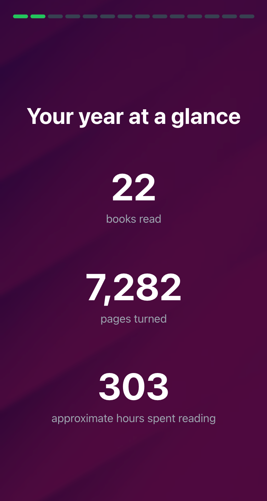
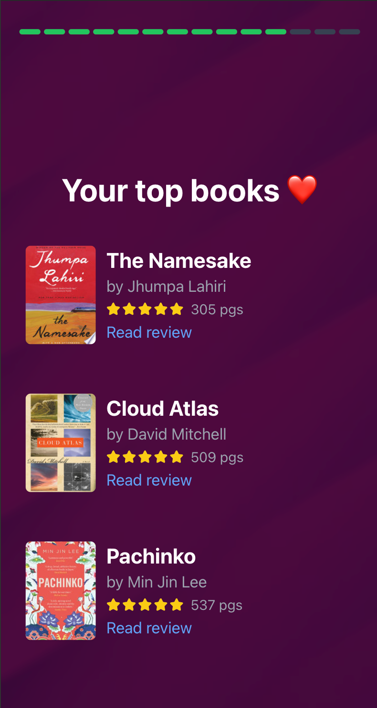
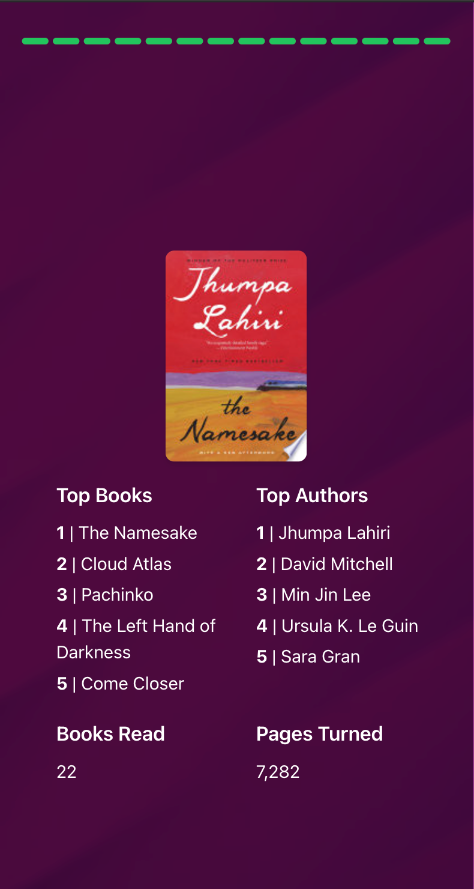

# Goodreads Wrapped

An interactive, story-driven visualization of your Goodreads reading history, inspired by wrapped-style yearly reviews. Upload your Goodreads export and get an engaging, animated journey through your reading year.

**TLDR:** like Spotify Wrapped, but for GoodReads.

**Live at: [reading-wrapped.netlify.app](https://reading-wrapped.netlify.app/)**  
Note: If experiencing slow backend response due to cold starts, you can follow the local setup instructions below)

## Overview

|           Your Year at a Glance            |             Top Books              |               Summary Page               |
| :----------------------------------------: | :--------------------------------: | :--------------------------------------: |
|  |  |  |

A full-stack application featuring:

- Story-driven React frontend with Framer Motion animations
- Flask backend handling CSV processing and external API integration
- Concurrent image fetching for book covers
- Local data processing with no persistence
- Mobile and desktop friendly design

## Features

- **Interactive Story Experience**: Journey through your reading year with nice animations and transitions
- **Comprehensive Statistics**: Deep dive into your reading habits, patterns, and achievements
- **Book Cover Integration**: Automatic book cover fetching from multiple sources
- **Responsive Design**: Works on both mobile and desktop
- **Private & Secure**: All processing happens locally, no data storage

## 🎬 Demo

<video width="1920" height="1080" controls>
  <source src="media/demo.mp4" type="video/mp4">
  Your browser does not support the video tag.
</video>

## Project Structure

```
goodreads-year-in-review/
├── frontend/               # React frontend application
│   ├── src/                # Source files
│   └── README.md           # Frontend documentation
└── backend/                # Flask backend service
    ├── app.py              # Main Flask application
    └── process_files.py    # Data processing section
    └── README.md           # Backend documentation
```

## Detailed Documentation

- [Frontend Documentation](./frontend/README.md) - React application details
- [Backend Documentation](./backend/README.md) - Flask service details

## 🚀 Quick Start

### Backend Setup

1. Navigate to backend directory:

```bash
cd backend
```

2. Install dependencies:

```bash
pip install -r requirements.txt
```

3. Start the Flask server:

```bash
python app.py
```

The backend service will start on port 5001.

### Frontend Setup

1. Navigate to frontend directory:

```bash
cd frontend
```

2. Install dependencies:

```bash
npm install
```

3. Start the development server:

```bash
npm run dev -- --host
```

Visit `http://localhost:5173` to see the application or the web addresses listed to view on mobile.

## Configuration

### Environment Variables

Frontend (.env):

```env
VITE_API_BASE_URL=your_backend_url
```

Backend (.env):

```env
FLASK_ENV=development
PORT=5001
```

## 📱 Deployment

### Frontend

Currently hosted on Netlify:

- Live at [reading-wrapped.netlify.app](https://reading-wrapped.netlify.app/)

### Backend

Deployed on Render's free tier:

- Initial cold starts may take up to 40 seconds
- Service spins down after periods of inactivity
- Auto-scales based on usage

## Contributing

Contributions are welcome! Please feel free to submit a Pull Request. For major changes, please open an issue first to discuss what you would like to change.

1. Fork the Project
2. Create your Feature Branch (`git checkout -b feature/AmazingFeature`)
3. Commit your Changes (`git commit -m 'Add some AmazingFeature'`)
4. Push to the Branch (`git push origin feature/AmazingFeature`)
5. Open a Pull Request

## Technical Stack

### Frontend

- React with Vite
- Tailwind CSS
- Framer Motion
- shadcn/ui components

### Backend

- Flask
- Pandas
- aiohttp for async operations
- External APIs: Google Books, Open Library

## License

MIT License

## Acknowledgments

- Goodreads for the export functionality
- Google Books API
- Open Library API
- All the amazing open-source libraries used in this project

---

## Disclaimer

This is an unofficial, fan-made project and is not affiliated with, endorsed by, or connected to Goodreads, Amazon, or Spotify in any way. This project is:

- Not an official Goodreads product
- Not associated with Goodreads or Amazon
- Not monetized or used for commercial purposes
- A personal project created for educational and entertainment purposes only
- Inspired by various year-in-review experiences but independently created

The Goodreads name and logo are trademarks of Amazon.com, Inc. or its affiliates. This project uses publicly available Goodreads export data that users choose to analyze, and does not store or collect any user data.
